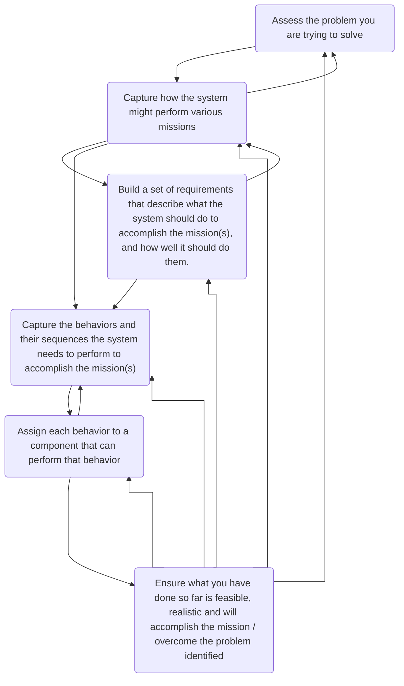

"# patrickvanhemert.github.io" 

# Experimenting

```mermaid
---
config:
  flowchart:
    htmlLabels: false    
    curve: monotoneY
    shape: rect
---
graph TD
  a("`Assess the problem you are trying to solve`")
  a --> b("`Capture how the system might perform various missions`")
  b --> c("`Build a set of requirements that describe what the system should do to accomplish the mission(s), and how well it should do them.`")  
  b --> a
  b --> d
  c --> d("`Capture the behaviors and their sequences the system needs to perform to accomplish the mission(s)`")
  c --> b
  d --> e("`Assign each behavior to a component that can perform that behavior`")
  e --> d
  e --> f("`Ensure what you have done so far is feasible, realistic and will accomplish the mission / overcome the problem identified`")  
  f fa@----> a
  fa@{ curve: stepAfter }
  f fb@----> b
  fb@{ curve: stepAfter }
  f fc@----> c
  fc@{ curve: stepAfter }
  f fd@----> d
  fd@{ curve: stepAfter }
  f fe@----> e
  fe@{ curve: stepAfter }  
```
